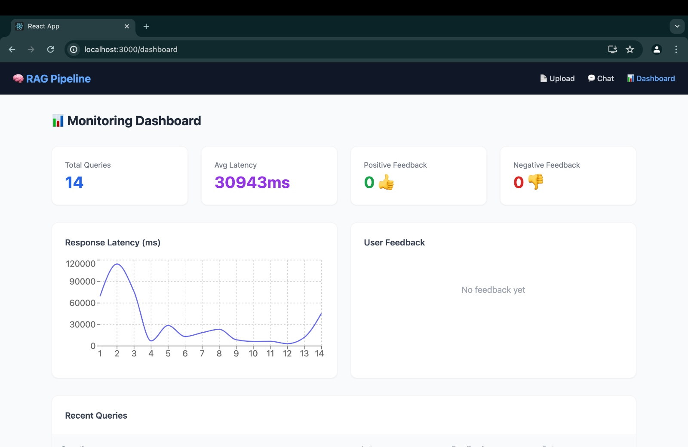
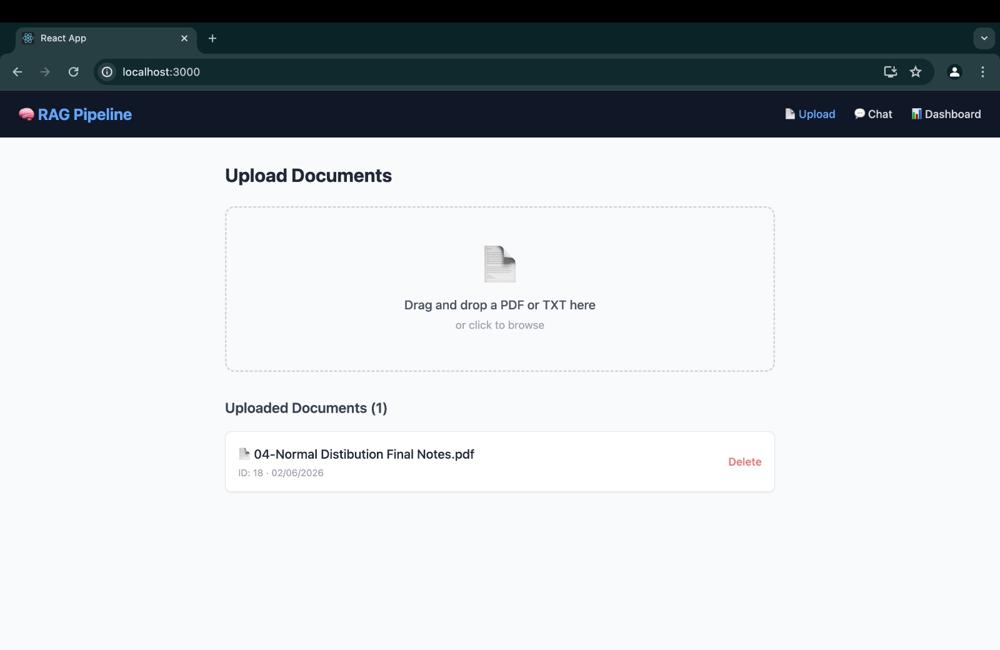
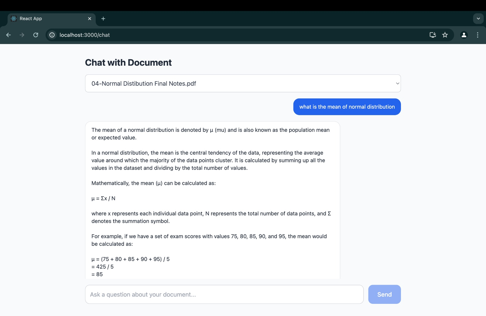

# RAG Pipeline 🧠

A full-stack Retrieval-Augmented Generation (RAG) application that lets you upload documents and chat with them using AI.

## Screenshots

### Upload Documents

### Chat with Document

### Monitoring Dashboard

## Tech Stack
- **Frontend:** React, Tailwind CSS
- **Backend:** FastAPI, Python
- **AI:** Ollama (Llama 3.2), Sentence Transformers
- **OCR:** Tesseract (for scanned PDFs)

## Features
- Upload PDF and TXT files
- OCR support for scanned PDFs
- Semantic search with embeddings
- Chat with your documents
- Monitoring dashboard with latency metrics
